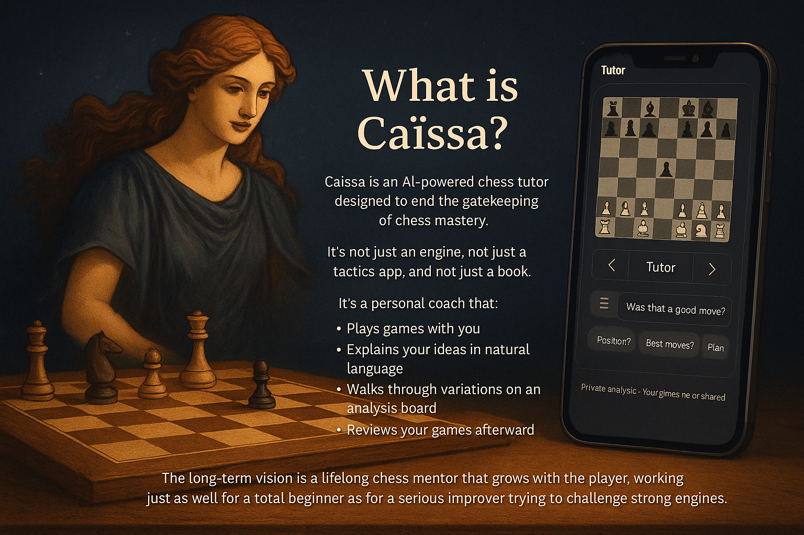

<!-- Banner -->

  

<h1 align="center">Caïssa – The Lifelong Chess Tutor</h1>

  Where chess wisdom, engines, and memory come together to teach every player.

---

## What is Caïssa?

**Caïssa** is an AI-powered chess tutor designed to _end the gatekeeping of chess mastery_.  
It’s not just an engine, not just a tactics app, and not just a book. It’s a **personal coach** that:

- Plays games with you
- Explains your ideas in natural language
- Walks through variations on an analysis board
- Reviews your games afterward
- Remembers your recurring mistakes and patterns over time

The long-term vision is a **lifelong chess mentor** that grows with the player, working just as well for a total beginner as for a serious improver trying to challenge strong engines.

This repo is the starting point for designing and implementing Caïssa’s **MVP**.

---

## Core Concept

### Dual-Board Experience

Caïssa’s signature UX is a **dual-board interface**:

- **Game Board** – where the real game is played (vs engine or human).
- **Analysis Board** – a sandbox where the tutor can:
  - Show “what if” lines
  - Compare candidate moves
  - Illustrate tactical motifs
  - Demonstrate plans from grandmaster games
  - Revisit past mistakes in similar positions

This separation keeps competitive play clean while still enabling rich, interactive teaching.

---

## Teaching Modes (MVP Scope)

The MVP should support three teaching modes, all powered by the same core engine + LLM stack, but with different depth and tone.

1. **Beginner Mode**

   - Audience: players who may not fully know the rules.
   - Focus:
     - Simple principles: center control, development, king safety.
     - Plain language, no eval bars, no engine jargon.
     - Basic “why this move?” explanations and safety checks.
   - Goal: make chess feel approachable, not intimidating.

2. **Improver Mode**

   - Audience: roughly 800–1800 rating (flexible, not strict).
   - Focus:
     - Candidate move thinking (“What 2–3 moves did you consider?”).
     - Tactical motifs (forks, pins, discovered attacks, loose pieces).
     - Positional concepts (pawn structures, weak squares, open files, piece activity).
   - Uses:
     - Engine analysis in the background.
     - Classical ideas (e.g., Nimzowitsch’s _My System_ and other strategic texts) as conceptual context.
   - Goal: help users understand _plans_, not just single best moves.

3. **Challenger Mode**
   - Audience: stronger improvers trying to play vs strong engines or significantly improve.
   - Focus:
     - Critical moments, practical decisions, trade-offs between sharp and safe lines.
     - Deeper lines on the analysis board when requested.
     - “Professional” solutions that balance complexity vs reliability.
   - Goal: serve as a strong training partner, not just an evaluator.

---

## Game Review (Key MVP Feature)

After each game, Caïssa offers a structured review:

1. **Your Story First**

   - User is prompted to describe what they thought was happening at key moments.
   - Encourages self-explanation and reflection.

2. **Key Moments, Not Every Move**

   - Identify:
     - Blunders and missed wins
     - Large evaluation swings
     - Strategic turning points
   - Show these on the analysis board with short, focused explanations.

3. **Conceptual Lessons**

   - Tag each key moment with themes:
     - “Loose piece tactics”
     - “Mishandled pawn break”
     - “King safety vs premature attack”
     - “Endgame king activity”, etc.

4. **Takeaways**
   - End each review with 1–3 concrete lessons in plain language.
   - Optional: short drills built from the player’s own game positions (roadmap, may not be in the very first build).

---

## Memory & Player Model (MVP Level)

Caïssa should start building a simple **player model** even in the MVP:

- Track:

  - Common tactical misses (e.g., forks, back-rank mates).
  - Repeated strategic issues (e.g., pushing flank pawns instead of developing, avoiding central pawn breaks).
  - Phase weaknesses (opening/middlegame/endgame).

- Use this model to:
  - Highlight recurring patterns in game reviews.
  - Slightly tailor explanations (“You often struggle with X; here it shows up again.”).

For MVP, a lightweight tagging and statistics approach is sufficient.  
No complex ML required initially; that can evolve later.

---

## Roadmap: Later (Non-MVP) Ideas

These ideas are important but **not required for the MVP**. They should be treated as expansion points:

- **Advanced “Red-Team” Feedback from Strong Players**

  - Strong users can challenge Caïssa’s advice, provide corrected explanations and lines.
  - Their feedback can be used to refine the tutor via RLHF / preference learning.
  - This is a **later-phase feature**, not part of the initial release.

- **Richer Retrieval from Texts & GM Games**

  - Deeper integration of classical literature and curated grandmaster games.
  - Dynamic retrieval of relevant examples based on structures and motifs.

- **Drill Generation at Scale**
  - Automatic creation of personalized problem sets sourced from the user’s own games and similar positions in databases.

---

## Platform & Viral Potential

**Initial focus should be mobile**, with desktop/web as a parallel or follow-up surface:

- Mobile is critical for virality and stickiness:
  - Quick game + review loops on the go.
  - Push notifications for lesson reminders and reviews.
  - Easy sharing of positions and insights.

Recommended direction:

- **Mobile-first UX**:
  - Native or cross-platform (e.g., React Native or Flutter) for iOS and Android.
  - Clean, thumb-friendly dual-board interface.
- **Backend & APIs**:
  - A service layer that:
    - Manages users, games, and sessions.
    - Orchestrates engine analysis + LLM explanations.
    - Stores memory and player models.

Desktop/web can reuse much of the same backend and conceptual model, but **mobile should not be an afterthought**.

---

## Status

This repository is currently a **concept and coordination seed**:

- `AGENT.md` directs an AI coding agent (e.g., Codex) on next steps.
- `README.md` describes the vision and MVP scope at a high level.
- There is **no code yet**; the next step is to:
  - refine requirements,
  - choose architecture and stack,
  - and define an implementation plan.

Contributions—human or AI—should treat this README as the product’s guiding intent.
