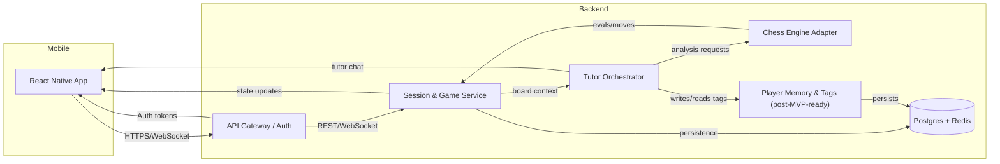

# Caïssa Architecture – Draft

_Status: Draft for review_

## 1. Goals & Guiding Principles
- **Mobile-first dual-board UX** with low-latency interactions.
- **Clear separation** between tutoring brain, chess engine, and game session management so tutoring stays on the player’s side.
- **Extensibility** toward post-game review, multiplayer, and RLHF feedback without re-architecting.
- **Observability & safety** baked into each service (latency tracking, guardrails, content filtering).

## 2. Target Tech Stack (MVP)
| Layer | Technology | Rationale |
| --- | --- | --- |
| Mobile app | React Native (TypeScript, Expo runtime) | Rapid cross-platform delivery; rich ecosystem for board UIs, OTA updates, integrates well with push/analytics later. |
| State mgmt | Zustand or Redux Toolkit (RN) | Lightweight predictable state; supports dual-board sync and tutor chat. |
| Backend API | Node.js + TypeScript (NestJS or Fastify) | Strong TypeScript pipeline, familiar dev experience, easy to share types with RN client. |
| Realtime transport | WebSocket (Socket.IO) + REST | REST for setup/profile, WebSocket for tutor chat & move updates. |
| Chess engine | Stockfish (native binary) wrapped with child process or WASM inside backend | Battle-tested, supports depth/time tuning per mode. |
| LLM orchestration | OpenAI API (GPT-4 or equivalent) via backend service | Centralized prompt control, handle privacy & caching server-side. |
| Storage | PostgreSQL (Supabase / RDS) + Redis cache | Structured data for users/games, Redis for session state & throttling. |
| Observability | OpenTelemetry + hosted logs/metrics (Datadog/Grafana) | Trace engine/LLM calls, measure tutor latency, monitor failures. |

## 3. High-Level System Diagram

## 4. Service Responsibilities

### 4.1 Mobile App (React Native)
- Maintains dual-board state (active game vs sandbox analysis board) and tutor conversation context.
- Handles authentication (magic link/device) and stores short-lived tokens securely (SecureStore/Keychain).
- Communicates with backend via REST for session setup and WebSocket for move/tutor streaming.
- Provides user-assurance copy: "Your tutor conversation is private" when in chat overlay.
- Prepares UX hooks for post-MVP features (e.g., review entry point, notifications toggle).

### 4.2 API Gateway / Auth
- Validates tokens, rate-limits requests, and routes to internal services.
- Issues JWT access tokens after email/device auth; refresh via short secret.
- Enforces tutor privacy by ensuring tutor chat events are scoped to the requesting user’s session only.

### 4.3 Session / Game Service
- Owns game lifecycle: creation, turn tracking, time controls, takebacks.
- Persists move list, board state, and metadata in Postgres (PGN-like schema, see Section 5).
- Publishes state updates over WebSocket; ensures dual-board parity.
- Requests engine moves, applies results, and informs Tutor Orchestrator of new positions.

### 4.4 Chess Engine Adapter
- Manages a pool of Stockfish workers (native binary or WASM) with per-mode depth/time parameters.
- Accepts FEN + search settings, returns best move, evaluation, and principal variation.
- Provides deterministic sampling knobs (e.g., configurable randomness for Beginner mode).
- Streams progress for latency-sensitive use, though client only needs final results.

### 4.5 Tutor Orchestrator
- Accepts conversation intents: "what if", "summarize new position", "review last move".
- Pulls necessary context: current board (from Session service), recent chat, user mode/persona, memory tags (future).
- Calls Chess Engine Adapter when needed for candidate lines or evaluations.
- Crafts prompts for LLM, merges engine insight + persona tone, streams responses back to client.
- Applies safety filters (length, disallowed content) before delivering.

### 4.6 Player Memory & Tags (Post-MVP scaffold)
- Stores tag counters, sample positions, last-seen timestamps in the same Postgres DB (separate tables).
- Exposes read APIs for referencing patterns in tutoring once implemented.
- Accepts write events from future review pipeline; for MVP, only schema and placeholder endpoints exist.

## 5. Data Model (Initial Sketch)

### 5.1 Users
- `id (UUID)`
- `email` or `device_id`
- `display_name`
- `preferred_mode`
- `created_at`, `last_login_at`
- `settings`: JSONB (notification opt-in, takeback preference)

### 5.2 Sessions (Games)
- `id (UUID)`
- `user_id`
- `mode` (Beginner/Improver/Challenger)
- `time_control` (enum)
- `status` (active, completed, aborted)
- `moves`: JSONB array of SAN or UCI moves with timestamps
- `current_fen`
- `created_at`, `completed_at`

### 5.3 Tutor Conversations
- `id`
- `session_id`
- `message_index`
- `role` (player, tutor)
- `intent` (what_if, post_move, opponent_summary)
- `payload` (structured data for UI, e.g., eval delta, motif tags)
- `created_at`

### 5.4 Future Tables (Post-MVP)
- `review_key_moments`: session_id, move_index, tags, eval_swing.
- `player_patterns`: user_id, tag, count, last_seen.
- `rlhf_feedback`: placeholders for red-team later.

## 6. API Overview (MVP)

### REST
- `POST /auth/device` – exchange device fingerprint for token.
- `POST /auth/magic-link` – request email link.
- `POST /sessions` – create new tutor-guided game (mode/time/color in payload).
- `GET /sessions/{id}` – fetch current game state (for reconnects).
- `POST /sessions/{id}/move` – submit player move; server validates and forwards to engine.
- `POST /sessions/{id}/takeback` – request takeback if policy allows.

### WebSocket channels
- `session:{id}:state` – broadcast moves, clocks, board status.
- `session:{id}:tutor` – stream tutor responses (text + structured metadata).
- `session:{id}:system` – status updates (engine thinking, tutor typing, errors).

## 7. Non-Functional Architecture Concerns
- **Latency**: Keep engine depth modest for Beginner/Improver; use Redis queue to balance requests.
- **Scalability**: Stateless API tier behind load balancer; engine workers autoscale via container orchestrator (ECS/Kubernetes).
- **Security**: All tutor chats and session data encrypted in transit (TLS) and at rest; strict IAM for engine access.
- **Testing**: Contract tests between mobile app and backend; integration tests for orchestrator-engine handoff.

## 8. Roadmap Hooks
- Reserve API stubs for `/reviews` even if they return 501 initially.
- Keep Tutor Orchestrator prompt templates versioned to allow RLHF upgrades.
- Structure data tables so review and red-team additions do not require migrations (use JSONB for optional fields).

---
**Next Action:** Await review/feedback. After approval we will proceed to UX flows (`docs/ux-flows.md`) per collaboration ritual.
